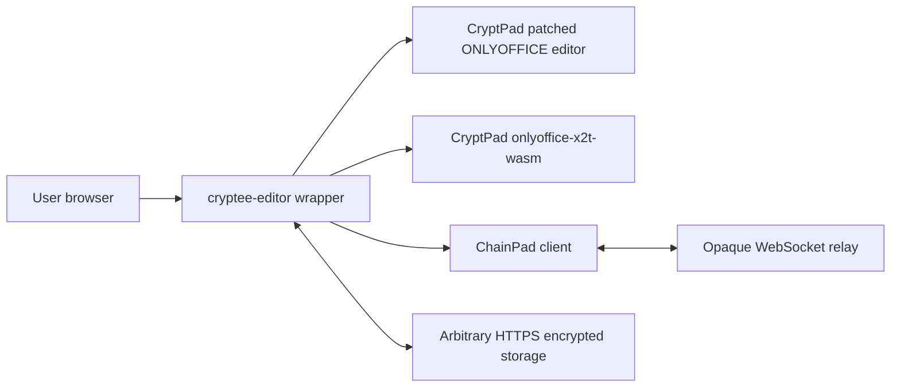
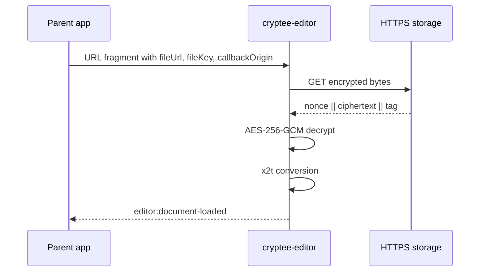
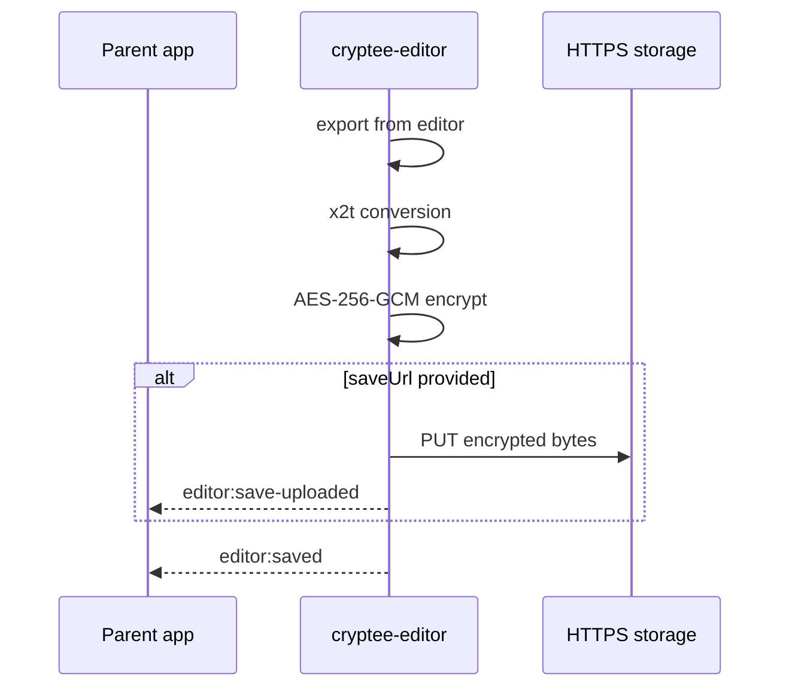
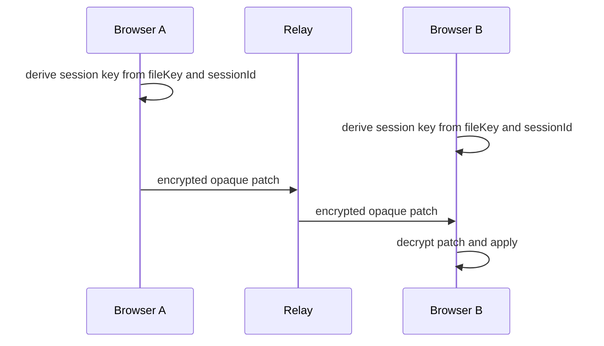

# Architecture

## Open Flow

## Save Flow

## Collaboration Flow

## E2EE Properties

The storage provider receives encrypted files only. The static host serves code but does not receive URL fragments. The relay receives encrypted patches only. The integrating application remains inside the trust boundary because it creates or handles `fileKey`.

## Performance Characteristics

ONLYOFFICE and x2t are large browser workloads. Expect hundreds of megabytes of downloaded vendor artifacts during build and significant runtime memory use for large documents. Production deployments should test expected document sizes on target browsers.

## Browser Compatibility

| Browser | Status |
| --- | --- |
| Chromium 120+ | Target |
| Firefox 120+ | Target |
| Safari 17+ | Target, subject to WASM memory behavior |
| Mobile browsers | Best effort for viewing; editing depends on ONLYOFFICE UI support |

## Upstream References

- https://github.com/cryptpad/onlyoffice-x2t-wasm
- https://github.com/cryptpad/onlyoffice-editor
- https://github.com/cryptpad/chainpad
- https://github.com/cryptpad/cryptpad

